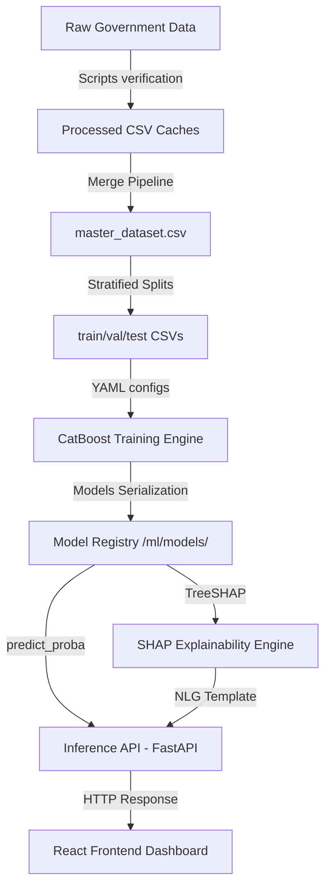

# End-to-End Machine Learning System Architecture

This document describes the flow of data from ingestion through preprocessing, training, serving, and explainability.

## 1. System Architecture Diagram

## 2. Ingestion to Inference Stages
- **Data Engineering**: Cleans, standardizes spelling, filters boundary states, and runs spatial-temporal joins.
- **Preprocessing & Feature Engineering**: Scales continuous variables, target-encodes locations, log-transforms EC, and clusters coordinates.
- **Model Registry**: Models are serialized as `.cbm` (CatBoost) binaries under versioned directories.
- **Serving layer**: FastAPI consumes input queries, retrieves rainfall normals, runs predictions, calculates TreeSHAP local forces, and generates farmer explanations in <20ms.
