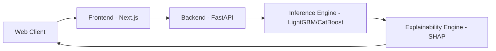

# Krishi Sarathi - System Design Document

This document describes the web application integration architecture.

## System Interfaces
- **API Request**: Expects Latitude, Longitude, N, P, K, pH.
- **Inference Pipeline**: Fetches District, Taluka, Soil Texture (Phase 1) and Rainfall (Phase 2) from caches based on Latitude/Longitude, compiles the ML input feature vector, and runs predictions.
- **SHAP Explanation**: Computes tree SHAP forces and converts them into natural language text explanations for the user.
