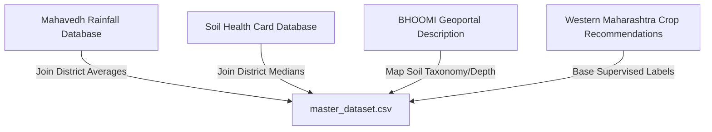

# Krishi Sarathi - Dataset Relationship Mapping

This document describes how all agricultural and climate datasets relate to form the final ML dataset.

## 1. Data Integration Flow

## 2. Structural Relationships
- **Crop Recommendations Dataset (Primary)**: Mapped to Pune Division districts (Kolhapur, Pune, Sangli, Satara, Solapur). Has a Many-to-One spatial relationship with district climate/soils attributes.
- **Rainfall (Many-to-One)**: Aggregated normal rainfall grouped by `District` is joined with the crop recommendation records.
- **Soil Health Card Database (Many-to-One)**: District-level medians for Organic Carbon (OC), Electrical Conductivity (EC), and 6 micronutrients are mapped to the primary crop records.
- **BHOOMI (One-to-One/Description)**: Categorical mappings of soil depth and capabilities describe the physical soil groups present in the districts.
