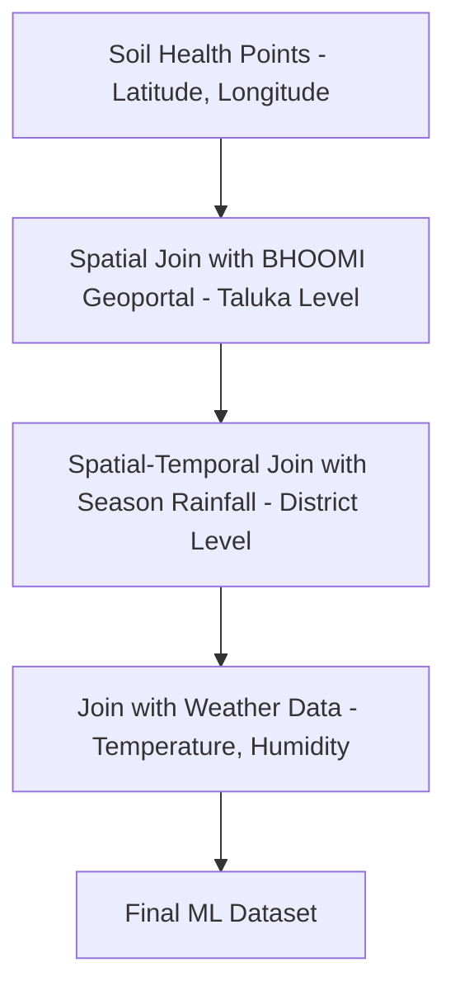

# Dataset Merge and Integration Pipeline

This document describes the design of the pipeline that integrates our soil points, rainfall, and spatial soil maps into a single ML-ready database.

## 1. Execution Order of Merging
To prevent information loss and maximize spatial fidelity, the merge pipeline must be executed in the following order:

## 2. Multi-Level Join Logic

### A. Soil Point to Taluka-Physical Maps (Spatial Join)
- **Key**: `[District, Taluka]`
- **Logic**: Join each point in `soil_health_database.csv` with BHOOMI's physical characteristics (Soil Texture, Soil Depth, Land Capability) mapped at the Taluka level. This appends physical soil parameters to the chemical properties of each sample.

### B. Soil Point to Monsoon Rainfall (Spatial-Temporal Join)
- **Key**: `[District, Year]`
- **Mapping Cycle to Year**:
  - Cycle `2015-17` joins with rainfall of Sowing `Year = 2016` (middle of cycle).
  - Cycle `2017-19` joins with rainfall of Sowing `Year = 2018`.
  - Cycle `2023-24` joins with Sowing `Year = 2023`.
  - Cycle `2024-25` joins with Sowing `Year = 2024`.

### C. Temperature and Humidity Merging
- **Key**: `[District, Month/Season]`
- **Logic**: Use historical meteorological averages for each district to inject standard crop growing temperature and humidity profiles.

## 3. Conflict Resolution and Missing Values
- **Spelling Mismatches**: Use the standardized naming dictionary (`standard_districts`) before executing pandas merge joins to prevent 0-match merges.
- **Imputation**: If a soil point is missing a nutrient value, impute using the **Taluka-level median** for that cycle, preserving localized soil chemistry.
