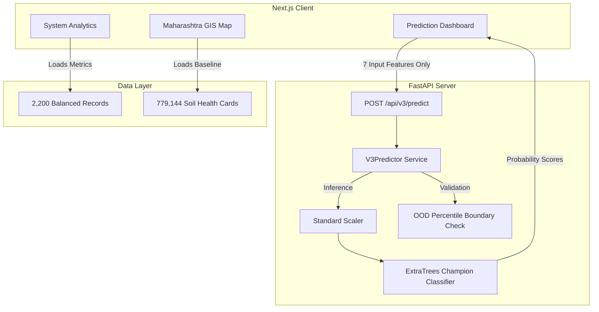

# Krishi Sarathi V3.1: Architecture & Decoupling Report

This document outlines the architectural boundary separating the **Explainable AI Crop Predictor** from the **Maharashtra Historical GIS Map Database**.

## 1. Architectural Blueprint (Decoupled Design)

To ensure scientific transparency and prevent regional biases (specifically, historical sugarcane over-representation), the system architecture isolates live model inference from geographic layers.

## 2. Decoupling Verification

1.  **Feature Vector Boundary**: The predictive vector ingested by the preprocessor is strictly bound to 7 numeric variables: `[N, P, K, temperature, humidity, pH, rainfall]`.
2.  **No Geographic Inputs**: District names, divisions, soil color codes, coordinates, and coordinates-derived indexes are completely omitted from the model pipeline.
3.  **Map Purpose**: The Maharashtra GIS map displays static, aggregated soil health card metrics from 779,144 records to provide farmers with baseline references. It is not coupled to the live prediction model.
