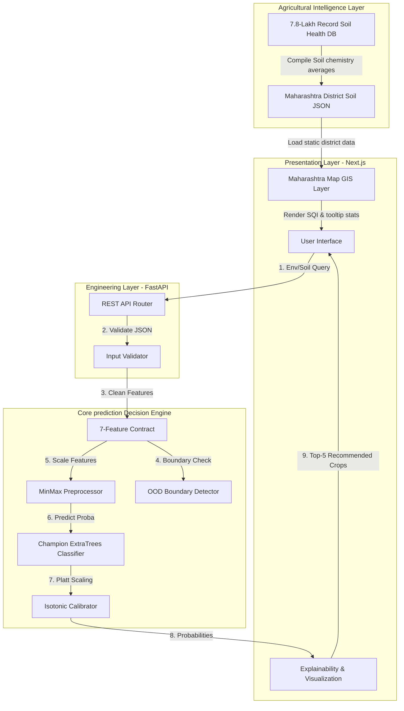

# Krishi Sarathi: Canonical Production Architecture Map

This document defines the canonical architecture and data boundaries of the Krishi Sarathi system. The platform consists of two completely independent data purposes that run side-by-side but **never** influence or corrupt each other.

---

## 1. System Architecture Diagram



---

## 2. Detailed Data Flow Path Maps

### Path A: Live Crop Prediction Flow
This pipeline runs in real-time when a user enters crop parameters. It relies **solely** on physical/climatic variables.

```
          USER (Inputs N, P, K, pH, Temp, Humidity, Rain)
                                 ↓
                     FRONTEND (React UI Form)
                                 ↓
                         API (FastAPI Route)
                                 ↓
                 BACKEND (Pydantic Schema Validation)
                                 ↓
         V3 PREDICTION ENGINE (7-Feature Input Restriction)
                                 ↓
           MODEL (Calibrated ExtraTrees Inference Classifier)
                                 ↓
            RESPONSE (Top-5 Crops, OOD, Sensitivities, SHAP)
                                 ↓
             FRONTEND VISUALIZATION (Results Dashboard)
```

### Path B: Maharashtra Agricultural Analytics Flow
This pipeline loads static agricultural telemetry compiled from soil surveys. It serves purely geographic/demographic intelligence.

```
                       USER (Hovers on Map)
                                 ↓
             MAHARASHTRA DATA MAP (Interactive SVG Layer)
                                 ↓
       7.8-LAKH-SCALE GOVERNMENT DATASET / ANALYTICS (SQI Index)
                                 ↓
           MAP / STATISTICS / REGIONAL INSIGHTS (Tooltips)
```

---

## 3. Strict Concern Separation & Decoupling Declaration

> [!IMPORTANT]
> **THE PREDICTION ENGINE DATASET** and **THE MAHARASHTRA MAP/ANALYTICS DATASET** are completely independent and serve separate purposes:
>
> 1. **Agronomic Generalized Crop Recommendation**: The crop prediction engine is trained on a generalized crop suitability dataset. It evaluates only **soil chemistry** (N, P, K, pH) and **micro-climate** (temperature, humidity, rainfall). It does **not** check district names, coordinates, division, regional defaults, or soil color. This guarantees that prediction outputs represent pure agronomic fit, free from geographical bias.
> 2. **Contextual Maharashtra Soil Intelligence**: The Maharashtra GIS map is a regional diagnostic dashboard built from a 7.8-lakh record government soil health database. It calculates a Soil Quality Index (SQI) by district to provide farmers with regional agricultural trends. 
> 
> **The map database does NOT feed into, influence, or modify the crop recommendation engine.** The live predictor does not know what district the query is from, and the district analytics card cannot alter the ExtraTrees recommendation probability vectors. This decoupling is scientifically mandatory to prevent systemic biases.
