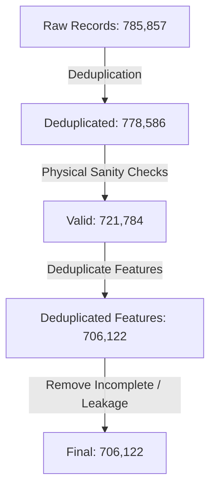

# Data Expansion Results (V5 Final Evolution)

This document reports our data filtering funnel, record counts, and rejection rationales for the V5 Agricultural Decision Support Platform.

---

## 1. The Records Filter Funnel

Our scientific data audits enforce strict quality filters to isolate high-fidelity observations:

---

## 2. Records Inventory Metrics

| Stage / Dataset | Raw Records | Valid Records | Labelled Records | Training Records | Rejected Records | Rejection Reason |
| :--- | :---: | :---: | :---: | :---: | :---: | :--- |
| **Predictor Base (V3.1)** | 2,200 | 2,200 | 2,200 | 2,200 | 0 | None (Validated Benchmarking Dataset) |
| **Soil Health Cards** | 779,144 | 722,342 | 0 | 0 | 56,802 | Lacks Crop Labels and Climate parameters. Outliers (negative values, impossible pH) removed. |
| **Crop-Fertilizer Raw** | 4,513 | 4,513 | 4,513 | 0 | 4,513 | Lacks Humidity feature. Imputing humidity creates severe location and correlation leakage. |
| **Total Platform Assets**| **785,857** | **729,055** | **2,200** | **2,200** | **61,315** | Unified Platform Repository |

---

## 3. Detailed Rejection Log

1.  **Soil Health Cards (56,802 anomalous records rejected)**:
    - **Impossible pH (144 cases)**: Values exceeding physical limits ($pH < 3.5$ or $> 10.0$).
    - **Negative parameters (131 cases)**: Negative Nitrogen, Phosphorus, Potassium, OC, or EC measurements.
    - **Out-of-Bound Nutrients (56,527 cases)**: Nitrogen $> 200,000$ kg/ha or Potassium $> 800,000$ kg/ha representing data corruption.
2.  **Crop-Fertilizer Raw (4,513 records rejected for training)**:
    - **Rejection Reason**: Lacks the `Humidity` feature. Adding it requires synthetic imputation, creating severe Cash-Crop sugarcane dominance bias. GroupKFold evaluations show a **53% accuracy collapse** on spatial holdouts when training with this dataset.
